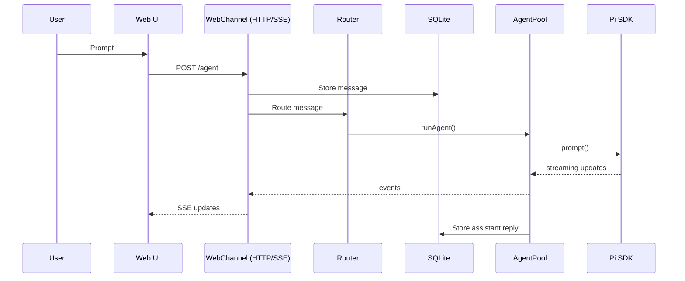
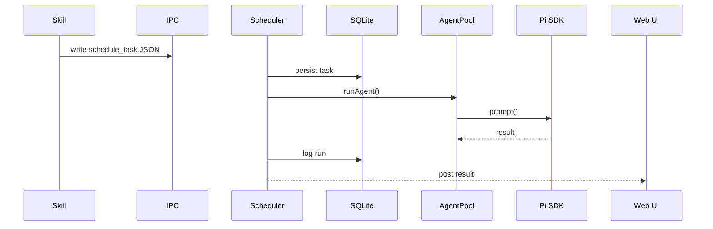

# Runtime flows

This document covers the primary web‑first flows. WhatsApp is documented separately in [whatsapp.md](whatsapp.md).

## Web UI → Agent → Web UI

The web UI supports steering mid‑response by queuing follow‑ups while streaming.

## Scheduled tasks / IPC

## Session lifecycle (summary)

- Messages for a chat JID share a warm `AgentSession`.
- Auto‑compaction runs when the context window is tight.
- Idle sessions are evicted after a short TTL.

See [architecture.md](architecture.md) for component layout and [tools-and-skills.md](tools-and-skills.md) for tool/skill details.
