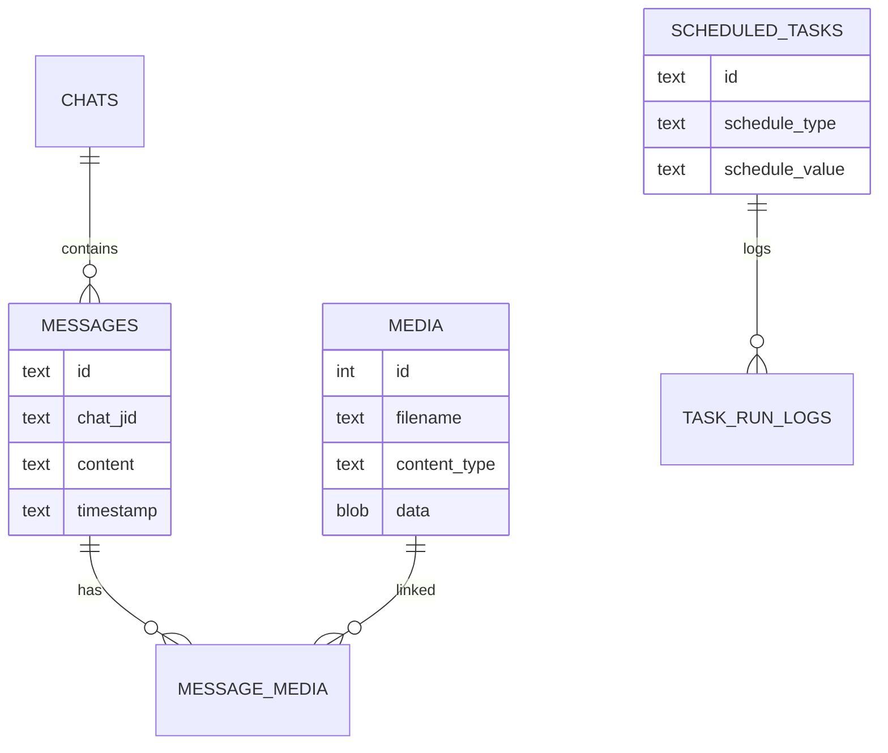

# Storage model

`piclaw` stores state in SQLite at `/workspace/.piclaw/store/messages.db`. The database is the source of truth for chat history, media, tasks, and token usage.

**Never delete this file.** Only repair or migrate it.

## Key tables

| Table | Purpose |
|-------|---------|
| `chats` | Known chat JIDs and metadata |
| `messages` | Message history |
| `messages_fts` | Full‑text search index |
| `media` | Attachment blobs |
| `message_media` | Message ↔ media join |
| `scheduled_tasks` | Task definitions |
| `task_run_logs` | Task run history |
| `token_usage` | Per‑assistant‑message token + cost usage |
| `tool_outputs` | Stored tool output summaries |
| `tool_outputs_fts` | Full‑text index for tool output |
| `router_state` | Polling cursors |

Attachments and link previews are stored on the message record (`content_blocks`, `link_previews`).

## Entity map



## Data paths

- `/workspace/.piclaw/store/messages.db` — SQLite database
- `/workspace/.piclaw/data/sessions/` — `pi` session JSONL history
- `/workspace/.piclaw/data/ipc/` — IPC messages and scheduled task files
- `/workspace/.piclaw/data/chats.json` — Known chat JIDs

## Backups

Restic snapshots are stored in the configured repository. The backup script lives at:

```
/workspace/.piclaw/restic/backup.sh
```
