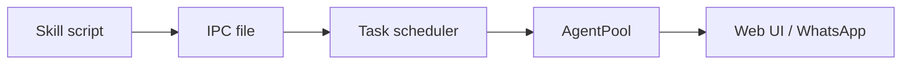

# Tools and skills

This document lists the tools and skills exposed to the agent, plus common slash commands.

## Agent tools

Core tools (from `pi`):

- `read` — read files
- `bash` — run shell commands
- `edit` — replace exact text
- `write` — write files

`piclaw` extensions:

- `attach_file` — attach a workspace file for download in the web UI (use `attachment:<filename>` in replies)
- `search_messages` — full‑text search across stored messages (FTS + hashtags + row lookup)
- `get_model_state` — show current model, thinking level, and context usage
- `list_models` — list available models/providers
- `switch_model` — switch to a different model
- `switch_thinking` — change thinking level (off → xhigh)

`search_messages` accepts `limit`, `offset`, and `details_max_chars` for controlling detail payloads.

## Skills

Skills live under:

- Project scope: `/workspace/.pi/skills`
- Global scope: `/home/agent/.pi/agent/skills`

Each skill keeps its script alongside its `SKILL.md` for portability. Current set:

| Skill | Purpose |
|------|---------|
| `debug` | Diagnose container issues and environment setup |
| `setup` | Scaffold a new project with bun + Makefile |
| `reload` | Force‑restart `piclaw` after code changes |
| `playwright` | Local Playwright browser automation |
| `schedule` | Create/modify scheduled tasks via IPC |
| `send-message` | Send chat messages immediately via IPC |
| `token-chart` | Generate token usage charts (from `token_usage`) |
| `graphite-power-chart` | Generate Zigbee/Graphite charts for the web timeline |

## Slash commands

Common direct commands (no LLM round‑trip):

- `/model [provider/model]`
- `/cycle-model [back]`
- `/thinking [level]`
- `/cycle-thinking`
- `/tasks [active|paused|completed|all]`
- `/scheduled [filter]`
- `/stats`, `/context`, `/state`
- `/compact [instructions]`, `/auto-compact on|off`
- `/abort`, `/abort-retry`, `/abort-bash`
- `/queue <msg>`, `/queue-all <msg>`
- `/session-name`, `/new-session`, `/switch-session`
- `/fork`, `/forks`, `/tree`, `/labels`
- `/agent-name`, `/agent-avatar`
- `/export-html`, `/restart`, `/commands`

## Skill pipeline

